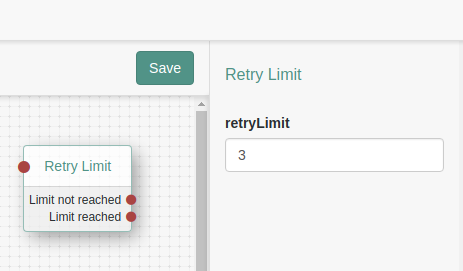

<b>Retry Limit Decision Authentication Node</b>
 
A simple authentication node, that allows a limit to be applied to a selected connection.  Contains a single configurable value that determines the maximum limit.  Has 2 outcomes: "Limit reached", "Limit not reached".
 
 
<b>Installation</b>
 
Copy the .jar file from the ../target directory into the ../web-container/webapps/openam/WEB-INF/lib directory where AM is deployed.  Restart the web container to pick up the new node.  The node will then appear in the authentication trees components palette.
 
 
<b>Usage</b>
 
The node provides 2 outcomes: "Limit reached", "Limit not reached".  Generally used in conjunction with collector nodes.  Eg user/password atttempts.
 
 
<b>To Build</b>
 
Edit the necessary RetryLimitDecisionNode.java as appropriate.  To rebuild, run "mvn clean install" in the directory containing the pom.xml
 
 

 
 
<b>Disclaimer</b>
The sample code described herein is provided on an "as is" basis, without warranty of any kind, to the fullest extent permitted by law. ForgeRock does not warrant or guarantee the individual success developers may have in implementing the sample code on their development platforms or in production configurations.

ForgeRock does not warrant, guarantee or make any representations regarding the use, results of use, accuracy, timeliness or completeness of any data or information relating to the sample code. ForgeRock disclaims all warranties, expressed or implied, and in particular, disclaims all warranties of merchantability, and warranties related to the code, or any service or software related thereto.

ForgeRock shall not be liable for any direct, indirect or consequential damages or costs of any type arising out of any action taken by you or others related to the sample code.